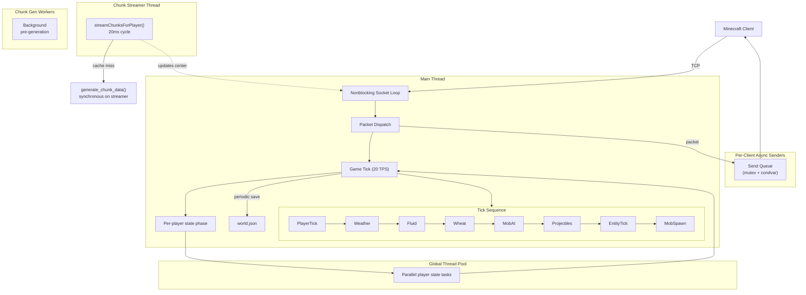
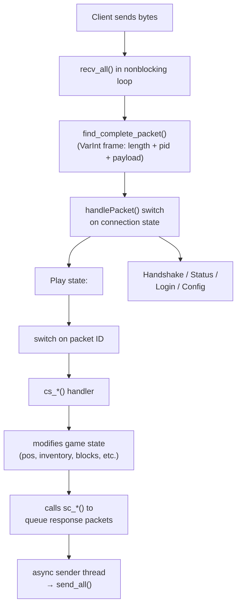
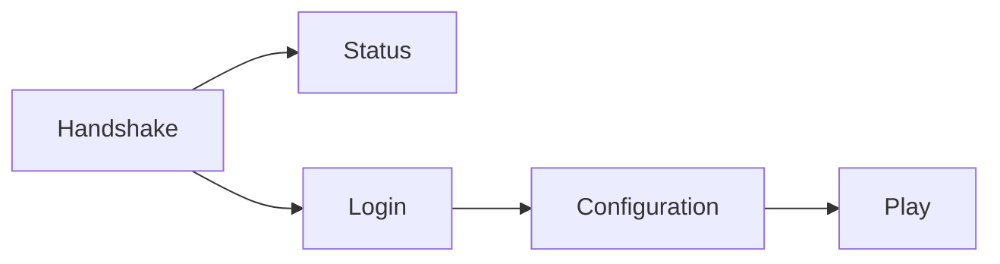
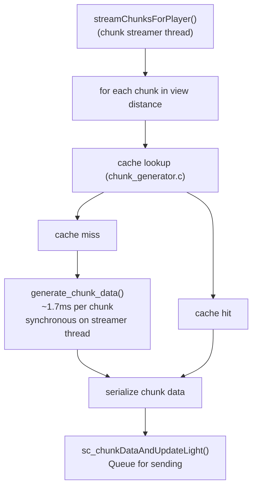

# Developer Documentation - irongingot

This document is for developers working on irongingot. It covers the project's architecture, code layout, design decisions, and how to extend it.

---

## Table of Contents

1. [Project Overview](#1-project-overview)
2. [Directory Structure](#2-directory-structure)
3. [Architecture Overview](#3-architecture-overview)
4. [Threading & Concurrency](#4-threading--concurrency)
5. [Packet Flow](#5-packet-flow)
6. [Chunk Pipeline](#6-chunk-pipeline)
7. [Game Tick](#7-game-tick)
8. [Block System](#8-block-system)
9. [Inventory System](#9-inventory-system)
10. [World Generation](#10-world-generation)
11. [Build System](#11-build-system)
12. [Config & Persistence](#12-config--persistence)
13. [Thread Safety Rules](#13-thread-safety-rules)
14. [How to Add a New Feature](#14-how-to-add-a-new-feature)
15. [Debugging & Profiling](#15-debugging--profiling)
16. [Code Generation](#16-code-generation)

---

## 1. Project Overview

**irongingot** is a minimalist Minecraft 1.21.8 (protocol 772) server written in C. It's a fork of [bareiron](https://github.com/p2r3/bareiron) that targets modern vanilla Minecraft while keeping a low memory footprint (~7MB with musl static).

### Design Goals

- **Low resource usage**: Runs on low-spec hardware, ~7MB RAM with musl
- **Single-threaded game logic**: No locks in hot paths; thread safety is by design
- **Minimal dependencies**: Bundled zlib, optional libcurl; no heavy frameworks
- **Vanilla-compatible**: Works with unmodified Minecraft clients
- **Portable**: Linux (glibc/musl), ARM64, Windows cross-compile

### Non-Goals

- ESP32 support (removed from bareiron)
- Mod/fabric loader support
- Online mode / Mojang authentication (planned but low priority)
- Redstone / complex mechanical systems

---

## 2. Directory Structure

```
irongingot/
├── include/               # Header files (one per .c module)
│   ├── registries.h       # GENERATED - block/item/entity IDs, palette tables
│   ├── generated_village_templates.h  # GENERATED - village NBT compiled to C
│   ├── globals.h          # Core data types: PlayerData, MobData, BlockChange, etc.
│   ├── packets.h          # Packet handler declarations
│   ├── worldgen.h         # World generation interface
│   ├── chunk_generator.h  # Chunk cache + parallel gen interface
│   ├── procedures.h       # Game tick procedure declarations
│   ├── tools.h            # Network I/O, packet framing helpers
│   ├── varnum.h           # VarInt/VarLong encode/decode
│   ├── config.h           # ServerConfig struct
│   ├── serialize.h        # world.json save/load
│   ├── special_block.h    # Interactive block state hash table
│   ├── crafting.h         # Recipe definitions
│   ├── creative_mode.h    # Creative inventory UI
│   ├── structures.h       # Tree/sapling placement
│   ├── mojang.h           # Mojang skin API (optional)
│   ├── async.h            # Empty compatibility header
│   ├── thread_pool.h      # Generic thread pool interface
│   ├── thread_utils.h     # pthread stack size helpers
│   ├── terminal_ui.h      # Terminal status panel
│   └── perlin.h           # Java-compatible Perlin noise
├── src/                   # Source files
│   ├── main.c             # Entry, nonblocking socket loop, packet dispatch, server tick, signals
│   ├── packets.c          # ~170+ MC protocol handlers (cs_*/sc_* functions)
│   ├── procedures.c       # Game logic: block changes, mob AI, combat, fluids, tick
│   ├── worldgen.c         # Terrain gen: Overworld/Nether/End, ores, biomes, structures
│   ├── chunk_generator.c  # Chunk cache (LRU), parallel gen coordination
│   ├── structures.c       # Tree/sapling placement
│   ├── config.c           # server.conf parser
│   ├── serialize.c        # world.json save/load
│   ├── tools.c            # send_all/recv_all, packet framing, async packet senders, fast_rand(), favicon
│   ├── varnum.c           # VarInt/VarLong read/write
│   ├── crafting.c         # Crafting + furnace recipe tables
│   ├── creative_mode.c    # Creative inventory UI (scrollable list)
│   ├── special_block.c    # State hash table + wheat tracking list
│   ├── mojang.c           # Skin fetch via Mojang API (optional)
│   ├── thread_utils.c     # pthread create with controlled stack sizes
│   ├── async.c            # Generic thread pool implementation
│   ├── terminal_ui.c      # Terminal status panel + log
│   ├── globals.c          # Global state initialization
│   ├── registries.c       # GENERATED - block palette, registry blobs
│   ├── generated_village_templates.c  # GENERATED - village NBT
│   ├── noise/
│   │   └── perlin.c       # Java-compatible Perlin noise
│   └── cubiomes/          # Git submodule - biome gen, structure finders
├── third_party/
│   ├── cjson/             # Vendored cJSON (world.json parsing)
│   └── zlib/              # Vendored zlib (packet compression)
├── images/                # Screenshots, logo, banner
├── build.sh               # Single binary build
├── build_all.sh           # Full release packaging (4 targets)
├── rebuild.sh             # One-command: download server.jar → dump registries → codegen → compile
├── build_registries.js    # Generate registries.h + registries.c from vanilla data
├── build_village_templates.js  # Generate village templates from NBT
├── extract_registries.sh  # Automates dumping from vanilla server.jar
├── bench_worldgen.c       # World generation benchmark
├── bench_worldgen.sh      # Worldgen benchmark runner
├── decode_tags.py         # Tag decoding utility
├── server.conf            # Runtime config
├── world.json             # Auto-saved world state
├── README.md              # User-facing README
├── DEVELOPER.md           # This file
├── MISSING_FEATURES.md    # Unimplemented features by priority
├── LLM_REPO_DOCS.md       # LLM context file (compressed for AI assistants)
└── LICENSE                # GPL-3.0
```

---

## 3. Architecture Overview



### High-Level Flow

1. **Minecraft client** connects via TCP and sends raw bytes
2. **Main thread's nonblocking socket loop** reads raw bytes from connected clients
3. **Packet dispatch** (`main.c:handlePacket()`) reads the VarInt packet ID and calls the appropriate handler
4. **`cs_*()` handlers** (client-to-server) process the packet, modify game state
5. **`sc_*()` calls** enqueue response packets onto the client's async send queue
6. **Async sender workers** drain the per-client queues and call `send_all()`
7. **Game tick** runs at `config.tick_interval` - player state, weather, fluids, wheat, mob AI, projectiles, item/XP entities, mob spawning
8. **Chunk streamer** (`streamChunksForPlayer()`) runs in a **dedicated thread** (20ms cycle), checking which chunks players need and generating them synchronously on cache miss

---

## 4. Threading & Concurrency

| Thread | Count | Work |
|--------|-------|------|
| **Main** | 1 | nonblocking accept/read, packet dispatch, game tick scheduling |
| **Global thread pool** | 1 to `config.max_thread_pool` | Parallel per-player tick state tasks; packet sends still happen after the parallel phase |
| **Chunk streamer** | 1 | `streamChunksForPlayer()` in 20ms cycle, synchronous chunk gen |
| **Chunk gen workers** | up to 6 | Background pre-generation from request queue |
| **Async senders** | `MAX_PLAYERS` worker slots | Drain per-client send queues → `send_all()` |

### Design Principle

The main thread owns packet dispatch, tick orchestration, and most world mutations. Per-player tick state can run in the global thread pool, then the main thread sends the resulting packets. Shared subsystems use explicit synchronization: send queues, chunk cache/request queues, block-change snapshots, and the special-block table.

### Communication Between Threads

| Pathway | Mechanism |
|---------|-----------|
| Main → Async sender | Per-client mutex + condvar on `send_queue` |
| Main → Global thread pool | `ThreadPool` task queue (`src/async.c`) |
| Main → Chunk gen workers | Mutex-protected request queue (`request_mutex` + `request_cond`) |
| Chunk streamer ↔ LRU cache | `cache_mutex` plus per-chunk lock buckets on generation |
| Chunk gen workers → LRU cache | Same mutex/lock-bucket path; `generating` flag marks in-progress entries |
| Main ↔ Fluid queue | Lock-free ring buffer (`volatile` head/tail) |
| Main → World save | Synchronous write on tick (periodic) |
| Any thread → Special blocks | `special_block_mutex` in `special_block.c` |

---

## 5. Packet Flow



### Packet Naming Convention

- **`cs_`** = client-to-server handlers (parsing incoming data)
- **`sc_`** = server-to-client helpers (building outgoing packets)

Handlers live in `packets.c`. The main switch is in `main.c:handlePacket()`.

### Connection State Machine



Compression is enabled after login (threshold from `config.compression_threshold`). Uncompressed framing is VarInt(packet_length) + VarInt(packet_id) + payload. With compression enabled, the frame is VarInt(packet_length) + VarInt(data_length) + either compressed `(packet_id + payload)` bytes or uncompressed `(packet_id + payload)` when `data_length == 0`.

---

## 6. Chunk Pipeline

Chunks are generated **synchronously on demand** by the chunk streamer (a dedicated thread). A LRU cache serves as scratch buffer between generation and network serialization.

### Flow



### LRU Cache

- **Size**: `config.chunk_cache_size` entries (code default 8, server.conf sets 24)
- **Structure**: `CachedChunkData` array with LRU tracking
- **Per entry**: 20 section pointers (NULL = uniform/all-air), `uniform_blocks[20]`, `biomes[20]`
- **Lock**: `cache_mutex` for cache access plus per-chunk lock buckets during generation; `generating` marks in-progress entries
- **Dynamic allocation**: Sections allocated on demand

### Chunk Generation (generate_chunk_data)

1. Generate terrain heightmap (Perlin noise) + apply surface blocks (grass, sand, gravel) during `buildChunkSection()`
2. Apply biome palette (cubiomes)
3. Carve caves (4×4×4 density grid)
4. Place ores (4×4×4 density grid + Y-level + biome)
5. Place structures (villages, dungeons, mineshafts, strongholds, nether fortresses)
6. Fill block sections (20 sections × 4096 blocks each = 81920 blocks per chunk)
7. Register naturally-spawned wheat in the special blocks hash table for growth ticking
8. Store in LRU cache

The chunk gen workers opportunistically pre-generate chunks (when the request queue is idle, worker 0 scans around known players).

### Optimization Notes

- Cave/ore density grids use 4×4×4 precomputed samples → 128 noise calls instead of 8192 per section
- Trilinear interpolation on density grids prevents square artifacts
- Structure cell caches per-section in TLS → 1 `splitmix64` call instead of 4096
- Y-range guards skip function calls when above/below structure height ranges
- Biome height/scale use lookup tables instead of if-else chains

---

## 7. Game Tick

`handleServerTick()` in `procedures.c` runs at 20 TPS (`TIME_BETWEEN_TICKS=50000μs`; `tick_interval` remains a config field for compatibility).

### Tick Sequence

1. **World time + player state** — Advance daylight, update per-player loading/eating/air/damage/regen state, using the global thread pool when available; packet emission happens afterward on the main thread.
2. **Weather** — Update rain/thunder timers every 40 ticks and broadcast weather changes.
3. **Portal/bow handling** — Process portal travel and delayed bow release detection.
4. **Fluid Queue** — Process deferred water/lava flow updates (lock-free ring buffer).
5. **Inventory sync + world save check** — Periodically sync player inventory/attributes and call `writeDataToDiskOnInterval()`.
6. **Wheat growth** — Random growth tick over `wheat_coords[]`, with a fallback scan for untracked wheat.
7. **Mob AI** — Build the mob spatial grid, move mobs, update anger timers, sounds, random look-around. Villagers >256 blocks away skip AI.
8. **Projectiles** — Update arrow/ender pearl positions, collisions, damage, pickup/despawn.
9. **XP orbs + item entities** — Move/pick up XP orbs and item drops; despawn old entities.
10. **Mob spawning** — Spawn mobs around players at `config.mob_spawn_interval` if enabled.

### Wheat Growth

Wheat uses a dedicated tracking list (`wheat_coords[]` / `wheat_count` in `special_block.c`) to avoid scanning the hash table on every tick. The list grows dynamically - no fixed limit.

---

## 8. Block System

### Block IDs

~337 block types as `uint16_t` IDs defined as `B_*` macros in `registries.h` (generated). Examples: `B_stone = 127`, `B_grass_block = 134`, `B_dirt = 135`.

### Interactive Blocks

Blocks with state (doors, trapdoors, stairs, chests, furnaces, barrels, beds, ender_chests, fences, glass panes, ladders, wall torches, lecterns) store their state in a **separate hash table** in `special_block.c`, not in the chunk data.

**Hash table**: Dynamically growing (initial capacity 256, doubles at 75% load factor). Keyed by `entry_hash()` — an open-addressing hash with `(uint16_t)x ^ ((uint16_t)z<<1 | y<<17 | dimension<<25) * 0x9E3779B9`. Value is a packed `uint16_t` bitfield.

### State Encoding (`uint16_t` bitfields)

| Block Type | Bits | Meaning |
|-----------|------|---------|
| Doors | bit0=open, bit1=hinge, bits2-3=direction | |
| Trapdoors | bit0=open, bit1=half, bits2-3=direction | |
| Stairs | bits0-1=half, bits2-3=direction, bits4-6=shape | |
| Slabs | bits0-1=type | (generated-template packing only) |
| Furnaces | bits0-1=direction, bit2=lit | |
| Chests | bits0-1=direction | |
| Ender chests | bits0-1=direction, bit2=waterlogged | |
| Barrels | bits0-2=direction, bit3=open | |
| Fences/glass panes | bits0-3=N/E/S/W connections | |
| Beds | bits0-1=direction, bit2=head, bit3=occupied | |
| Horizontal-facing | bits0-1=direction (north/south/west/east) | |

### Block Changes (Player Edits)

Player block edits are recorded in `block_changes[]` (array of `BlockChange` structs with x, y, z, block ID, dimension). Dynamic allocation requires the compile-time `#ifdef INFINITE_BLOCK_CHANGES`; with it, the runtime `infinite_block_changes` config flag controls whether the array grows on demand (true) or uses a fixed capacity (false). Without the define, a static `BlockChange block_changes[MAX_BLOCK_CHANGES]` is used. Edits are persisted through `world.json` when world saving is enabled and replayed on load.

---

## 9. Inventory System

### Internal Slot Layout

| Slots | Purpose |
|-------|---------|
| `inventory_items[0-8]` | Hotbar |
| `inventory_items[9-35]` | Main inventory |
| `inventory_items[36-39]` | Armor (boots, leggings, chestplate, helmet) |
| `inventory_items[40]` | Offhand |
| `craft_items[0-8]` | 3×3 scratch grid used by player crafting, crafting tables, furnaces, merchants, and container overflow |

### Window Types

| Window Type | Slots | Mapping |
|-------------|-------|---------|
| Player inventory (`0`) | 46 client slots | Inventory + armor/offhand + 2×2 crafting/result mapped onto `inventory_*` and `craft_*` |
| Chest (`2`) | 27 chest + 36 player slots | Chest storage is packed into adjacent `block_changes` entries; player inventory mapping is shifted |
| Crafting table (`12`) | 46 client slots | 3×3 crafting grid + result + player inventory |
| Furnace (`14`) | 3 furnace slots + player inventory | Furnace slots map to `craft_items[0-2]` |
| Merchant (`19`) | 3 merchant slots + player inventory | Merchant slots map to `craft_items[0-2]` |

Slot translation between server and client uses `serverSlotToClientSlot()` / `clientSlotToServerSlot()` defined in `procedures.c` and declared in `include/procedures.h`.

### Items

Items are stored as `uint16_t` item IDs with parallel count arrays and damage arrays. Enchantments and other item components are not persisted.

Creative mode inventory uses a pre-built item list in `creative_mode.c`, which constructs the creative inventory tab window with all available blocks/items.

---

## 10. World Generation

### Terrain Generation (`worldgen.c`)

Terrain uses Java-compatible Perlin noise (via `noise/perlin.c`) for:
- **Base terrain height**: Multi-octave noise
- **Detail**: Secondary noise for hills/mountains
- **Caves**: 4×4×4 precomputed density grid with trilinear interpolation
- **Ores**: Grid-based with Y-level + biome filtering

### Biomes

Biome assignment uses [cubiomes](https://github.com/Cubitect/cubiomes) (git submodule at `src/cubiomes/`). The biome generator produces a 4×4 biome grid per chunk section.

### Dimensions

- **Overworld**: Full terrain gen with biomes, caves, ores, structures
- **Nether**: Netherrack/ceiling/lava sea, nether structures, nether biomes
- **End**: Main/outer End stone islands with a simple center exit portal; obsidian platform/pillars are not implemented

### Structures

| Structure | File | Details |
|-----------|------|---------|
| Villages | `worldgen.c` | 5 styles × 13 professions, NBT templates rotated toward center |
| Dungeons | `worldgen.c` | Mossy+cobble, chests, spawners |
| Mineshafts | `worldgen.c` | Oak planks, rails, cobwebs |
| Strongholds | `worldgen.c` | Silverfish, portal room |
| Nether fortresses | `worldgen.c` | Nether brick, blaze spawners |
| Trees | `structures.c` | 8 species (oak, birch, spruce, jungle, acacia, dark oak, azalea, cherry) |

### Village House Placement

Houses are placed at fixed offsets from the village center. Each house rotates so its front door faces the center. All houses in a village use the center's biome style to prevent mixed taiga/birch edges.

Helpers in `worldgen.c`:
- `houseRotation()` - computes rotation from house position to center
- `rotLocal()` - rotates local coordinates
- `rotBlockDir()` - type-aware rotation (doors/stairs/trapdoors/beds/chests/horizontal-directional/fences only)
- Generated templates preserve stair shape + slab type

### Performance Optimizations

See [LLM_REPO_DOCS.md](./LLM_REPO_DOCS.md#world-gen) for detailed worldgen benchmark data (~6.6× speedup vs original) and the optimization techniques used.

---

## 11. Build System

### Build Targets

| Target | Compiler | Libraries | Output |
|--------|----------|-----------|--------|
| Linux glibc | `gcc` | System zlib + libcurl (opt) | Dynamically linked (~30MB RAM) |
| Linux musl | `musl-gcc` | Bundled zlib | Statically linked (~7MB RAM) |
| Linux ARM64 musl | `zig cc` | Bundled zlib | Cross-compiled static (~7MB RAM) |
| Windows | `x86_64-w64-mingw32-gcc` | Bundled zlib + ws2_32 | Cross-compiled (~30MB RAM) |

### Scripts

| Script | Purpose |
|--------|---------|
| `build.sh` | Build single binary (detects target from compiler) |
| `build_all.sh` | Build all targets + create release .zips |
| `rebuild.sh` | **All-in-one**: downloads server.jar → dumps registries → generates code → compiles |

### Prerequisites for `./rebuild.sh`

- Java 21+ JDK (for running Minecraft's data generator)
- Node.js/Bun/Deno (for `build_registries.js`)
- curl

### Build Commands

```sh
./rebuild.sh                    # Full: data dump + codegen + compile
VERSION=1.2.3 ./build_all.sh    # Full release packaging
./build.sh                      # Quick single binary (assumes registries exist)
./build.sh --musl               # musl static build
```

### Generated Files

These files are generated from vanilla `server.jar` data and should **not** be edited by hand:

| File | Generator | Source |
|------|-----------|--------|
| `include/registries.h` | `build_registries.js` | Registry dumps from server.jar |
| `src/registries.c` | `build_registries.js` | Registry blobs + palette tables |
| `include/generated_village_templates.h` | `build_village_templates.js` | NBT village structures |
| `src/generated_village_templates.c` | `build_village_templates.js` | NBT compiled to C arrays |

---

## 12. Config & Persistence

### server.conf

Parsed by `config.c` into the global `ServerConfig config` struct. INI-style format with sections:

| Section | Keys |
|---------|------|
| Network | `port`, `max_players`, `compression_threshold`, `network_timeout`, `mojang_api_timeout_ms` |
| Game | `gamemode`, `difficulty`, `view_distance`, `mob_despawn_distance`, `mob_spawn_enabled`, `mob_spawn_max_per_player`, `mob_spawn_range`, `mob_spawn_min_distance`, `mob_spawn_interval` |
| Worldgen | `chunk_size`, `terrain_base_height`, `cave_base_depth`, `biome_size` |
| Game (cont.) | `world_seed`, `rng_seed` (in Game section in server.conf/config.h) |
| Performance | `chunk_cache_size`, `max_block_changes`, `infinite_block_changes`, `tick_interval`, `disk_sync_interval` |
| Performance (code only) | `max_packet_len`, `send_queue_limit`, `chunk_queue_limit`, `max_thread_pool` (defaults in config.c, not in distributed server.conf) |
| Features | `sync_world_to_disk`, `sync_blocks_on_interval`, `send_brand`, `broadcast_all_movement`, `scale_movement_updates`, `do_fluid_flow`, `allow_chests`, `allow_doors`, `enable_flight`, `enable_pickup_animation`, `enable_cactus_damage`, `enable_commands`, `fetch_skins_from_mojang`, `safe_area_radius` |
| Game Rules | `keep_inventory`, `do_immediate_respawn`, `natural_regeneration`, `do_daylight_cycle`, `do_weather_cycle` |
| Debug | `log_unknown_packets`, `log_length_discrepancy`, `log_chunk_generation`, `enable_beef_dumps` |
| Server Info | `motd`, `brand` |

### world.json

Auto-saved world state in JSON format (cJSON). Contains:

- `format_version` - Schema version
- `block_changes[]` - Player block edits
- `players[]` - Full player state (pos, inventory, health, XP, etc.)
- `special_blocks[]` - Interactive block states
- `mobs[]` - Persistent mob data

Saves occur at `disk_sync_interval` microsecond intervals when `sync_world_to_disk` is enabled (code and distributed config default: `15000000`, or 15 seconds).

---

## 13. Thread Safety Rules

```
Main thread:
  ✓ packet dispatch and most world/game mutations
  ✓ mob/projectile/item entity ticks
  ✓ outbound packet emission after parallel player updates

Global thread pool:
  ✓ per-player tick state updates only
  ✓ must not send packets directly

Chunk streamer thread:
  ✓ Reads LRU cache (mutex-protected)
  ✓ Calls generate_chunk_data() synchronously on cache miss
  ✓ Sends chunk packets via sc_chunkDataAndUpdateLight() → async send queue

Mutex-protected:
  • cache_mutex - LRU chunk data
  • per-chunk lock buckets - duplicate generation prevention
  • send_queue_mutex (per-client) - async send queue
  • special_block_mutex - special block hash table and wheat list
  • block_changes_mutex - block-change mutation/snapshot

Lock-free:
  • Fluid queue ring buffer (volatile head/tail)
  • generating marker on CachedChunkData

TLS:
  • Packet read/write buffers
  • Structure cell caches (worldgen)

Chunk gen workers:
  • Must NOT touch player/mob/block state directly
  • Pop chunk requests from mutex-protected queue
  • Write generated chunks into LRU cache (under cache_mutex)
  • May register generated wheat through special_block_* APIs
```

---

## 14. How to Add a New Feature

### Adding a New Block

1. Add `B_*` ID in `registries.h` (or regenerate)
2. If interactive (stateful): add state encoding in `special_block.h` + handler in `special_block.c`
3. Add block behavior handler in `procedures.c` (e.g., `handleCropGrowth()`, `handleFireTick()`)
4. Add placement/interaction check in `packets.c` (`cs_useItemOn()` or `cs_useItem()`)
5. Add creative inventory entry in `creative_mode.c` (if applicable)
6. Add worldgen placement in `worldgen.c` (if applicable)

### Adding a New Mob

1. Add mob type enum to existing mob type list in `globals.h`
2. Add AI behavior in `procedures.c:handleMobAI()`:
   - `switch(mob->type)` - movement, targeting, attacks, sounds
3. Add spawning logic in `procedures.c:spawnMobs()`
4. Add metadata/attributes in `packets.c` (`sc_spawnEntity()`, `sc_entityMetadata()`)
5. Add persistence in `serialize.c` (save/load)
6. Add equipment/loot drops in combat handling

### Adding a New Packet Handler

1. Find the packet ID from MC protocol docs or the existing hardcoded switch cases
2. Add a `cs_*()` function in `packets.c`:
   - Read packet fields using read helpers (`readByte()`, `readVarInt()`, etc.)
   - Validate state (is player in right phase? correct dimension?)
   - Modify game state
   - Call `sc_*()` to send responses
3. Add switch case in `main.c:handlePacket()`:
   ```c
   case PLAY_STATE:
       switch (packet_id) {
           // ...
           case CUSTOM_PACKET_ID:
               cs_customPacket(player);
               break;
       }
   ```
4. Add `sc_*()` response builder if needed

### Adding a New Command

1. Add command handler in `packets.c` (in the Chat Command/Message handler)
2. Parse command name and arguments from the chat message
3. Execute logic and send response via `sc_systemChat()`

---

## 15. Debugging & Profiling

### Debug Config Options

```ini
log_unknown_packets = true        # Log unhandled packet IDs (default: false)
log_length_discrepancy = true     # Log packet size mismatches (code default: true; distributed server.conf sets false)
log_chunk_generation = true       # Log chunk gen timing (default: false)
```

### Worldgen Benchmark

```sh
./bench_worldgen.sh               # Run worldgen performance benchmark
```

### Common Debugging Approaches

- **Packet debugging**: Enable `log_unknown_packets` to see unhandled protocol IDs
- **Crash debugging**: Build with glibc (not musl) for better debug symbols + gdb
- **Memory issues**: Use `valgrind` or `address sanitizer` (`-fsanitize=address`)
- **Threading issues**: Use `-fsanitize=thread` during development
- **Chunk gen**: Enable `log_chunk_generation` and watch per-chunk timing
- **Network issues**: Use Wireshark or tcpdump to inspect raw packet bytes

### Build with Debug Symbols

```sh
# Edit build.sh to add -g -O0 -DDEBUG to CFLAGS
# Or just add to CFLAGS env:
CFLAGS="-g -O0 -DDEBUG" ./build.sh
```

---

## 16. Code Generation

### Registry Generation

```sh
# Manual steps (or use ./rebuild.sh)
./extract_registries.sh          # Dumps registries from vanilla server.jar
node build_registries.js          # Generates include/registries.h + src/registries.c
```

`build_registries.js` reads the vanilla registry dumps and produces:
- Block/item/entity ID definitions
- Block state palette tables
- Creative inventory item list

### Village Template Generation

```sh
node build_village_templates.js   # Generates include/generated_village_templates.h + src/generated_village_templates.c
```

Reads village structure NBT files from the server.jar extraction and compiles them into C arrays with rotation + placement metadata.

---

## Key Files Cheatsheet

| Need to... | Look in |
|------------|---------|
| Understand global state | `include/globals.h` |
| Add a packet handler | `src/packets.c` + `main.c:handlePacket()` |
| Change game tick logic | `src/procedures.c:handleServerTick()` |
| Add block behavior | `src/procedures.c` + `src/special_block.c` |
| Change world generation | `src/worldgen.c` |
| Add/modify structure | `src/worldgen.c` (structures) or `src/structures.c` (trees) |
| Change config options | `src/config.c` + `include/config.h` |
| Change save/load format | `src/serialize.c` |
| Change networking | `src/tools.c` + `src/async.c` |
| Modify build process | `build.sh`, `build_all.sh`, `rebuild.sh` |
| Add creative item | `src/creative_mode.c` |
| Add crafting recipe | `src/crafting.c` |
| Regenerate from vanilla | `rebuild.sh` or `extract_registries.sh` + `build_registries.js` |
| Debug worldgen perf | `bench_worldgen.c` |
| Check what's missing | `MISSING_FEATURES.md` |

---

## See Also

- [README.md](./README.md) - User-facing documentation
- [MISSING_FEATURES.md](./MISSING_FEATURES.md) - Unimplemented features by priority
- [LLM_REPO_DOCS.md](./LLM_REPO_DOCS.md) - Compressed project overview for AI assistants
