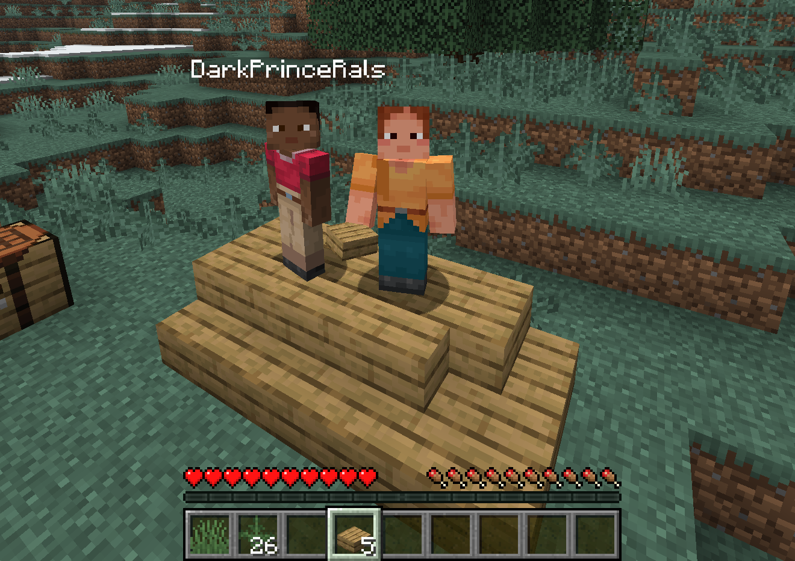

**irongingot** is a fork of [bareiron](https://github.com/p2r3/bareiron) - a minimalist Minecraft server for low-spec hardware. This fork keeps the low memory usage and adds some much-needed features.

Runs on as low as **~7MB of RAM** !!!

> [!NOTE]
> Unlike the original bareiron, **ESP32 is not supported** in this fork.



- **Minecraft version:** `1.21.8`
- **Protocol version:** `772`
- **Base project:** bareiron by p2r3

> [!WARNING]
> Only vanilla clients are supported. Fabric and other mod loaders may have issues.

## What's New

- **Doors and stairs** - They work now
- **Trees and vegetation** - Biome-appropriate trees, flowers, and grass generate in the world
- **Better terrain** - Improved world generation with better caves, mountains, and ore distribution
- **Config file** - Change settings in `server.conf` instead of recompiling
- **Multithreaded chunk gen** - Chunk generation runs on a separate thread
- **Infinite block changes** - Optional unlimited building with dynamic memory allocation
- **Musl libc support** - Build with `--musl` flag for ~7MB RAM usage (vs ~30MB with glibc)
- **Performance fixes** - Various optimizations for chunk streaming and packet handling

## Quick Start

You can download pre-built binaries from the [Releases page](https://github.com/TheShovel/irongingot/releases), or compile the server yourself. See the **Compilation** section below for instructions.

### Configuration

Edit `server.conf` to customize your server:

```ini
port = 25565
max_players = 16
gamemode = 0
view_distance = 10
world_seed = 0xA103DE6C
infinite_block_changes = true
motd = A irongingot server
brand = irongingot
```

## Compilation

Before compiling, you'll need to dump registry data from a vanilla Minecraft server. On Linux, this can be done automatically using the `extract_registries.sh` script. Otherwise, the manual process is as follows: create a folder called `notchian` here, and put a Minecraft server JAR in it. Then, follow [this guide](https://minecraft.wiki/w/Minecraft_Wiki:Projects/wiki.vg_merge/Data_Generators) to dump all of the registries (use the _second_ command with the `--all` flag). Finally, run `build_registries.js` with either [bun](https://bun.sh/), [node](https://nodejs.org/en/download), or [deno](https://docs.deno.com/runtime/getting_started/installation/).

### Dependencies

| Platform | Required Packages |
|----------|-------------------|
| **Linux (glibc)** | `gcc`, `zlib1g-dev`, `libcurl4-openssl-dev` (Debian/Ubuntu) or `zlib`, `curl` (Arch) |
| **Linux (musl)** | `musl-tools` (Debian/Ubuntu), `musl` (Arch), or `musl-gcc` (Fedora) |
| **Windows (cross-compile)** | `mingw-w64` (zlib is bundled, no extra package needed) |
| **Windows (native/MSYS2)** | `mingw-w64-x86_64-gcc`, `mingw-w64-x86_64-zlib` |

### Build Commands

- **Linux + Windows (cross-compile):** `./build_all.sh` — outputs to `build/` (includes both glibc and musl binaries if musl-tools are installed)
- **Linux (glibc):** `./build.sh` — dynamically linked, ~30MB RAM usage
- **Linux (musl, recommended):** `./build.sh --musl` — statically linked, ~7MB RAM usage
- **Windows (native):** MSYS2 MINGW64 shell, install `mingw-w64-x86_64-gcc`, run `./build.sh`
- **Windows (32-bit):** MSYS2 MINGW64 shell, install `mingw-w64-cross-gcc`, run `./build.sh --9x`

> [!TIP]
> The musl build is **strongly recommended** for production use. It produces a fully static binary with ~75% lower memory footprint.

## Configuration

Most settings are in `server.conf`. Key options:

- **Performance:** `chunk_cache_size`, `tick_interval`, `broadcast_all_movement`
- **Features:** `allow_chests`, `do_fluid_flow`, `enable_flight`, `allow_doors`
- **World:** `view_distance`, `world_seed`, `infinite_block_changes`

## Skin Support

The server now fetches the signed `textures` property from Mojang on login using the player's UUID first and their username as fallback. This gives vanilla clients the account's real skin data automatically.

- glibc builds use the built-in `libcurl` backend when available
- musl builds fall back to the external `curl` command at runtime, so the host system still needs a working `curl` executable in `PATH`

- `fetch_skins_from_mojang = true`: enable Mojang skin lookup
- `mojang_api_timeout_ms = 3000`: total request timeout for Mojang profile/session lookups

The local `skins/` directory still works as a fallback:

- `skins/<uuid-without-dashes>.texture` or `skins/<playername>.texture`: base64 `textures` property value
- `skins/<uuid-without-dashes>.signature` or `skins/<playername>.signature`: optional signature for that value

If Mojang lookup fails and no local skin files exist, clients fall back to the default skin for that UUID.

## Non-Volatile Storage

World data auto-saves to `world.bin`.

## License

GPL-3.0 License - see [LICENSE](LICENSE).

## Credits

- Original [bareiron](https://github.com/p2r3/bareiron) by p2r3
- [cubiomes](https://github.com/Cubitect/cubiomes) for biome generation
- [Cosmopolitan Libc](https://github.com/jart/cosmopolitan) for cross-platform binaries
- [Alexballistic](https://www.youtube.com/@alexBallistic) for the server icon/logo
