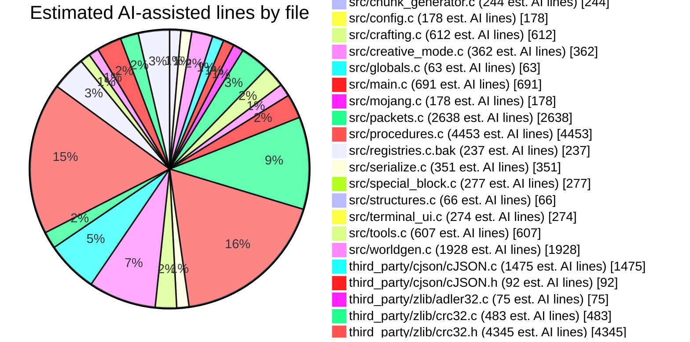

<div align="center">
  &nbsp;&nbsp;
  &nbsp;&nbsp;
  &nbsp;&nbsp;
  
</div>

**irongingot** is a fork of [bareiron](https://github.com/p2r3/bareiron) - a minimalist Minecraft server for low-spec hardware. This fork keeps the low memory usage and adds some much-needed features.

Runs on as low as **~7MB of RAM** !!!

> [!NOTE]
> Unlike the original bareiron, **ESP32 is not supported** in this fork.


- **Minecraft version:** `1.21.8`
- **Protocol version:** `772`
- **Base project:** bareiron by p2r3

> [!WARNING]
> Only vanilla clients are supported. Fabric and other mod loaders may have issues.

## What's New

Compared with the original bareiron, **irongingot** targets modern vanilla Minecraft and is much more feature-complete: it keeps the low-memory design, but adds configurable gameplay, richer terrain, structures, dimensions, mobs, inventories, and desktop/server-focused builds instead of ESP32 support.

- **More dimensions** - Nether and End support with portal travel, dimension-aware chunks, spawn fixes, and void death handling
- **More structures** - Villages, mineshafts, dungeons, strongholds, and Nether structure support
- **More mobs and entities** - Villagers, piglins, endermen, fish, arrows, and ender pearls
- **More interactions** - Chests, buckets, lava/water flow, flint and steel, farming, smelting, ores, bows, and creative inventory support
- **Doors and stairs** - They work now
- **Trees and vegetation** - Biome-appropriate trees, flowers, and grass generate in the world
- **Better terrain** - Improved world generation with better caves, mountains, ore distribution, and dimension-specific terrain
- **Config file** - Change settings in `server.conf` instead of recompiling
- **Terminal UI** - Server status and logs are shown in a terminal interface
- **Multithreaded chunk gen** - Chunk generation runs in worker threads
- **Musl libc support** - Build with `--musl` for ~7MB RAM usage, plus ARM64 musl cross-build support with Zig
- **Performance fixes** - Various optimizations for chunk streaming, fluid updates, packet handling, and CPU usage

## Quick Start

You can download pre-built binaries from the [Releases page](https://github.com/TheShovel/irongingot/releases), or compile the server yourself. See the **Compilation** section below for instructions.

## Compilation

`./rebuild.sh` does everything for you from a clean clone to a built binary in one command:

```sh
./rebuild.sh
```

It downloads and verifies the MC 1.21.8 `server.jar`, runs the vanilla data generator, extracts village structure NBT, regenerates all generated source files (`include/registries.h`, `src/registries.c`, `include/generated_village_templates.h`, `src/generated_village_templates.c`), then compiles the server.

Prerequisites for `./rebuild.sh`: Java 21+ JDK, Node.js, and curl. On Windows, use **WSL** (Windows Subsystem for Linux) to run the rebuild script.

### Dependencies

For the full release build on Debian/Ubuntu, install:

```sh
sudo apt install build-essential zlib1g-dev libcurl4-openssl-dev musl-tools mingw-w64 zip
```

For the full release build on Arch Linux, install:

```sh
sudo pacman -S --needed base-devel zlib curl musl mingw-w64-gcc zip
```

To also build the Linux ARM64 musl package, install [Zig](https://ziglang.org/download/) and make sure `zig` is on your `PATH`.

On Arch Linux, Zig can be installed with:

```sh
sudo pacman -S --needed zig
```

| Build target | Debian/Ubuntu packages | Arch Linux packages |
|--------------|------------------------|---------------------|
| **Linux x86_64 glibc** | `gcc`, `zlib1g-dev`, `libcurl4-openssl-dev` | `base-devel`, `zlib`, `curl` |
| **Linux x86_64 musl** | `musl-tools` | `musl` |
| **Linux ARM64 musl** | `zig` (cross-compiles with bundled zlib) | `zig` (cross-compiles with bundled zlib) |
| **Windows x86_64 cross-compile** | `mingw-w64` (uses bundled zlib) | `mingw-w64-gcc` (uses bundled zlib) |
| **Windows native/MSYS2** | `mingw-w64-x86_64-gcc`, `mingw-w64-x86_64-zlib` | N/A |

### Build Commands

Before building, generate `include/registries.h` as described above, or use `./rebuild.sh` to regenerate everything and build in one step.

- **Full data/codegen rebuild + local binary:** `./rebuild.sh`
- **All release packages:** `./build_all.sh`
  - writes packages to `build/`
  - builds `irongingot-v<VERSION>-linux-glibc.zip`
  - builds `irongingot-v<VERSION>-linux-musl.zip` when `musl-gcc` is available
  - builds `irongingot-v<VERSION>-linux-arm64-musl.zip` when `zig` is available
  - builds `irongingot-v<VERSION>-windows.zip` when a MinGW cross-compiler is available
- **Set release version:** `VERSION=1.2.3 ./build_all.sh`
- **Linux x86_64 glibc only:** `./build.sh` — dynamically linked, ~30MB RAM usage
- **Linux x86_64 musl only:** `./build.sh --musl` — statically linked, ~7MB RAM usage
- **Windows native:** MSYS2 MINGW64 shell, install `mingw-w64-x86_64-gcc`, run `./build.sh`
- **Windows 32-bit:** MSYS2 MINGW64 shell, install `mingw-w64-cross-gcc`, run `./build.sh --9x`

> [!TIP]
> The musl builds are **strongly recommended** for production use. They are fully static and are intended to provide the lower memory usage described above, including the ARM64 package.

## Development

See [DEVELOPER.md](./DEVELOPER.md#3-architecture-overview) for the full architecture diagram, threading model, packet flow, and chunk pipeline details.

## Configuration

Edit `server.conf` to customize your server:

```ini
port = 25565
max_players = 16
gamemode = 0
view_distance = 10
world_seed = 0xA103DE6C
infinite_block_changes = true
motd = A irongingot server
brand = irongingot
```

Key options include:

- **Performance:** `chunk_cache_size`, `tick_interval`, `broadcast_all_movement`
- **Features:** `allow_chests`, `do_fluid_flow`, `enable_flight`, `allow_doors`
- **World:** `view_distance`, `world_seed`, `infinite_block_changes`

## Non-Volatile Storage

World data auto-saves to `world.json`.

## License

GPL-3.0 License - see [LICENSE](LICENSE).

## Credits

- Original [bareiron](https://github.com/p2r3/bareiron) by p2r3
- [cubiomes](https://github.com/Cubitect/cubiomes) for biome generation
- [Cosmopolitan Libc](https://github.com/jart/cosmopolitan) for cross-platform binaries
- [Alexballistic](https://www.youtube.com/@alexBallistic) for the server icon/logo

## AI Contribution

Approximately **46%** of this project was made with AI assistance.
Based on the currently tracked text files, that is about **29,637 AI-assisted lines** out of **64,436 total lines**. The chart below omits files with fewer than 60 estimated AI-assisted lines, because it would look ugly, and why make a pie chart if it looks ugly. This was calculated using Opencode history.


